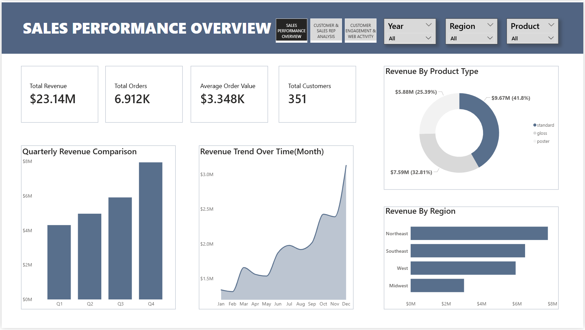
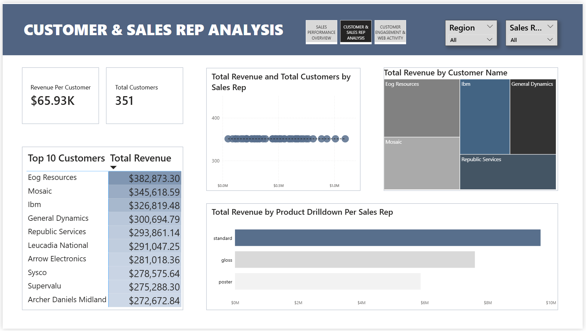
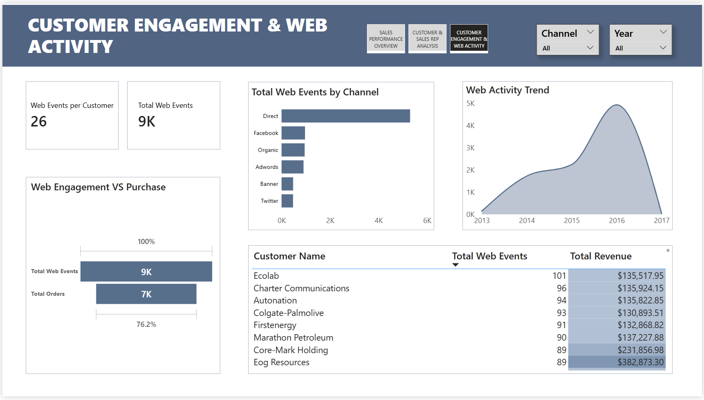

# parch-posey-sales-analysis 

Parch & Posey Sales Analytics (SQL + Power BI)

# Project Overview

This project analyzes sales performance, customer behavior, and web engagement using SQL and Power BI.

---

# Business Objectives

* Analyze revenue trends
* Identify top customers and regions
* Evaluate sales rep performance
* Understand web engagement impact

---

# Dataset

Tables used:

* orders
* accounts
* sales_reps
* region
* web_events

---

# Tools Used

* SQL Server (Data Extraction)
* Power Query (Data Cleaning)
* Power BI (Modeling & Visualization)

---

# Data Process

1. Extracted data using SQL queries (JOIN, GROUP BY, HAVING)
2. Cleaned data in Power Query (data types, trimming, validation)
3. Converted snowflake schema into star schema
4. Created DAX measures (Total Revenue, Orders, Customers)
5. Built interactive dashboards

---

# Key Insights

* Total revenue: **$23.14M**
* Standard paper is top-performing product
* Q4 is the strongest sales period
* Revenue is concentrated among top customers
* Web engagement strongly correlates with sales

---

# Recommendations

* Focus on high-value customers
* Improve web-to-sales conversion
* Strengthen Q4 marketing strategy

---

# Dashboard Preview

# Sales Overview

# Customer & Sales Rep Analysis

# Web Engagement

---

# Author

Umanah Emmanuel
